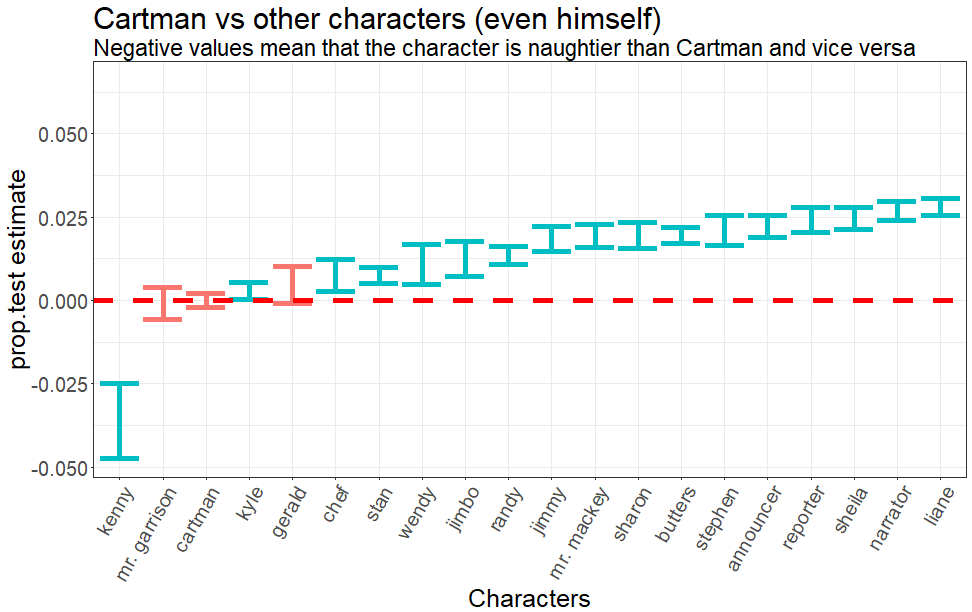

## Web scraping and R packages


[South Park episode transcripts](https://southpark.wikia.com/wiki/Portal:Scripts)


[IMDB South Park episode ratings](https://www.imdb.com/title/tt0121955/episodes)

Main R packages: [tidyverse](https://www.tidyverse.org/),
[tidytext](https://www.tidytextmining.com/),
[southparkr](https://github.com/pdrhlik/southparkr)


---

## Glimpse at the data


```
## Observations: 312,767
## Variables: 16
## $ season                <fct> Season Thirteen, Season One, Season Sixt...
## $ season_number         <int> 13, 1, 16, 5, 15, 3, 11, 9, 13, 3, 21, 8...
## $ season_episode_number <dbl> 7, 10, 14, 10, 10, 4, 1, 2, 5, 15, 6, 1,...
## $ episode               <fct> Fatbeard, Damien, Obama Wins!, How to Ea...
## $ episode_number        <int> 188, 10, 237, 75, 219, 35, 154, 127, 186...
## $ character             <chr> "cartman", "stan", "kyle", "jonesy", "mr...
## $ year                  <int> 2009, 1997, 2012, 2001, 2011, 1999, 2007...
## $ line_number           <int> 63817, 4528, 76451, 31001, 72011, 16346,...
## $ word                  <chr> "hey", "bubye", "program", "wrong", "gen...
## $ word_stem             <chr> "hei", "buby", "program", "wrong", "gene...
## $ swear_word            <lgl> FALSE, FALSE, FALSE, FALSE, FALSE, FALSE...
## $ episode_name          <chr> "Fatbeard", "Damien", "Obama Wins!", "Ho...
## $ air_date              <date> 2009-04-22, 1998-02-04, 2012-11-07, 200...
## $ user_rating           <dbl> 8.2, 8.1, 7.5, 8.1, 7.6, 6.7, 8.8, 8.8, ...
## $ user_votes            <dbl> 1578, 1703, 1156, 1488, 1229, 1546, 2356...
## $ score                 <int> NA, NA, NA, -2, 2, NA, NA, NA, NA, NA, N...
```

---

## Basic statistics about the show

<div class="basic-stats-table">
<table class="table" style="margin-left: auto; margin-right: auto;">
 <thead>
  <tr>
   <th style="text-align:left;display: none;"> figures </th>
   <th style="text-align:left;display: none;"> text </th>
  </tr>
 </thead>
<tbody>
  <tr>
   <td style="text-align:left;font-family: southpark;"> 21 </td>
   <td style="text-align:left;"> Number of seasons </td>
  </tr>
  <tr>
   <td style="text-align:left;font-family: southpark;"> 287 </td>
   <td style="text-align:left;"> Number of episodes </td>
  </tr>
  <tr>
   <td style="text-align:left;font-family: southpark;"> 914 475 </td>
   <td style="text-align:left;"> Number of words </td>
  </tr>
  <tr>
   <td style="text-align:left;font-family: southpark;"> 312 767 </td>
   <td style="text-align:left;"> No stopwords (a, the, this, ...) </td>
  </tr>
  <tr>
   <td style="text-align:left;font-family: southpark;"> 6 170 </td>
   <td style="text-align:left;"> Number of swear words </td>
  </tr>
  <tr>
   <td style="text-align:left;font-family: southpark;"> 1.97 </td>
   <td style="text-align:left;"> % of swear words </td>
  </tr>
  <tr>
   <td style="text-align:left;font-family: southpark;"> 34.2 </td>
   <td style="text-align:left;"> % used for analysis </td>
  </tr>
  <tr>
   <td style="text-align:left;font-family: southpark;"> 4 403 </td>
   <td style="text-align:left;"> Number of characters </td>
  </tr>
  <tr>
   <td style="text-align:left;font-family: southpark;"> 8.14 </td>
   <td style="text-align:left;"> Mean IMDB rating </td>
  </tr>
  <tr>
   <td style="text-align:left;font-family: southpark;"> 9.6 </td>
   <td style="text-align:left;"> Scott Tenorman Must Die (S05E04) </td>
  </tr>
  <tr>
   <td style="text-align:left;font-family: southpark;"> 6.3 </td>
   <td style="text-align:left;"> A Million Little Fibers (S10E05) </td>
  </tr>
</tbody>
</table>
</div>


---

## How much who talks?


---

## Most used words by characters


---

## Overall swear word ratio


---

## Character swear word ratio


---

## Overall sentiment analysis


---

## Character sentiment analysis


---

## Episode popularity


--- #naughty-episodes

## Are naughty episodes more popular?


--- #mysterion

## So who's the naughtiest character?


---

## It's Kenny!


---



---

## Contact

[https://www.linkedin.com/in/patrik-drhlik/](https://www.linkedin.com/in/patrik-drhlik/)


[https://github.com/pdrhlik](https://github.com/pdrhlik)


[@PatrioScraper](https://twitter.com/PatrioScraper)


[patrik.drhlik@gmail.com](mailto:patrik.drhlik@gmail.com)


[https://www.patrio.blog](https://www.patrio.blog)


